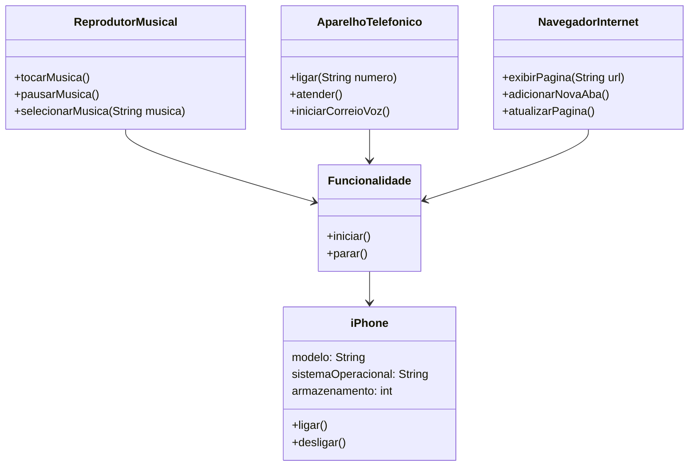

### Diagrama UML iPhone (Mermaid)

```mermaid
classDiagram
    class ReprodutorMusical {
        +tocarMusica()
        +pausarMusica()
        +selecionarMusica(String musica)
    }

    class AparelhoTelefonico {
        +ligar(String numero)
        +atender()
        +iniciarCorreioVoz()
    }

    class NavegadorInternet {
        +exibirPagina(String url)
        +adicionarNovaAba()
        +atualizarPagina()
    }

    class Funcionalidade{
        +iniciar()
        +parar()
    }

    class iPhone {
        modelo: String
        sistemaOperacional: String
        armazenamento: int
        +ligar()
        +desligar()
    }

    ReprodutorMusical --> Funcionalidade
    AparelhoTelefonico --> Funcionalidade
    NavegadorInternet --> Funcionalidade
    Funcionalidade --> iPhone
```
