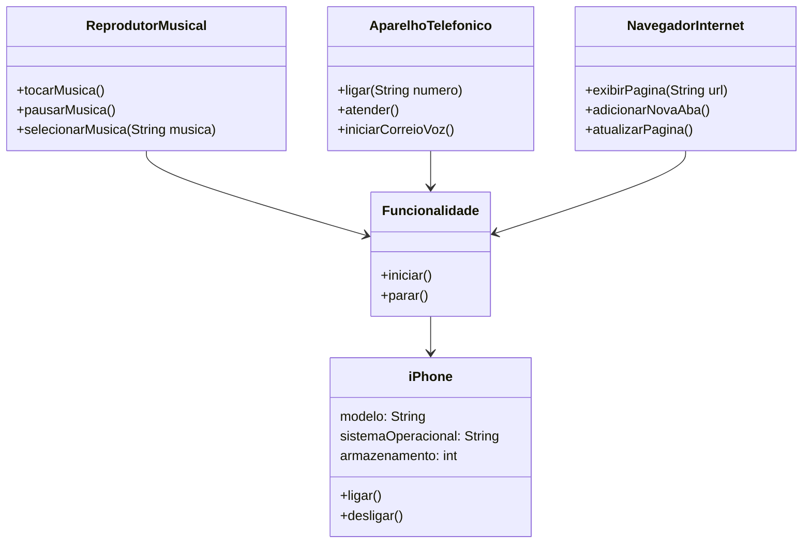

### Diagrama UML iPhone (Mermaid)

### Explicação do Diagrama

- **iPhone** é a classe principal que representa o dispositivo iPhone. Ele possui atributos como: modelo, sistema operacional e armazenamento. E métodos básicos para ligar e desligar o dispositivo.
- **Funcionalidade** é uma classe base abstrata que define a estrutura básica para funcionalidades específicas do iPhone como iniciar e parar..
- **ReprodutorMusical**: Classe que herda de Funcionalidade, responsável por tocar, pausar e selecionar músicas.
- **AparelhoTelefonico**: Classe que herda de Funcionalidade, responsável por ligar, atender chamadas e iniciar correio de voz. 
- **NavegadorInternet**: Classe que herda de Funcionalidade, responsável por exibir página, adicionar nova aba e atualizar páginas da web.
