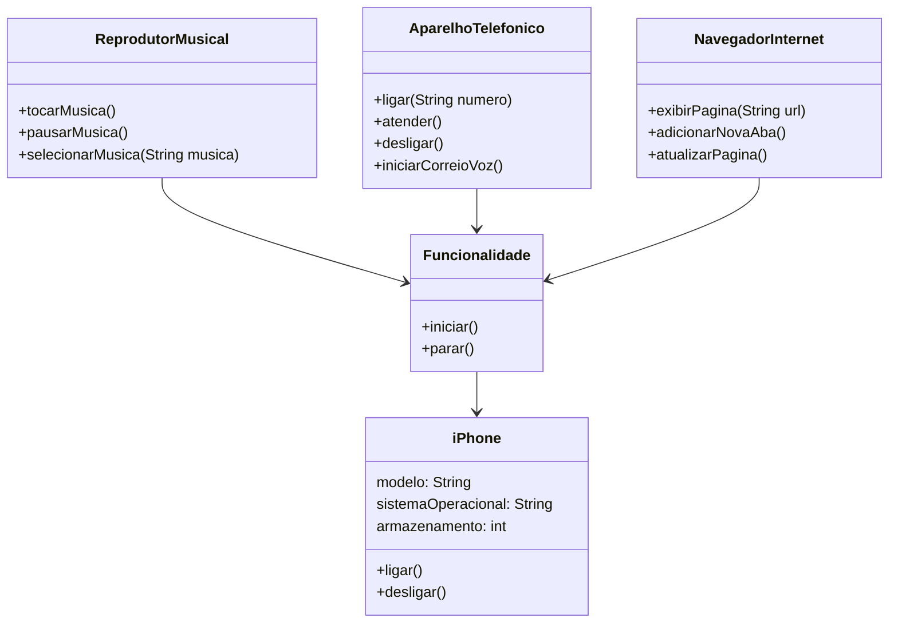

### Diagrama UML iPhone (Mermaid)




### Explicação do Diagrama

- **iPhone** é a classe principal que representa o dispositivo iPhone. Ele possui atributos como: modelo, sistema operacional e armazenamento. E métodos básicos para ligar e desligar o dispositivo.
- **Funcionalidade** é uma classe base abstrata que define a estrutura básica para funcionalidades específicas do iPhone como iniciar e parar..
- **ReprodutorMusical**: Classe que herda de Funcionalidade, responsável por tocar, pausar e selecionar músicas.
- **AparelhoTelefonico**: Classe que herda de Funcionalidade, responsável por ligar, atender, desligar chamadas e iniciar correio de voz. 
- **NavegadorInternet**: Classe que herda de Funcionalidade, responsável por exibir página, adicionar nova aba e atualizar páginas da web.


### Código Java para as Classes

```java
public class iPhone {
    private String modelo;
    private String sistemaOperacional;
    private int armazenamento;

    public void ligar() {
        System.out.println("iPhone ligado");
    }

    public void desligar() {
        System.out.println("iPhone desligado");
    }
}

abstract class Funcionalidade {
    public abstract void iniciar();
    public abstract void parar();
}

class ReprodutorMusical extends Funcionalidade {
    public void iniciar() {
        System.out.println("Reprodutor Musical iniciado");
    }

    public void parar() {
        System.out.println("Reprodutor Musical parado");
    }

    public void tocarMusica() {
        System.out.println("Tocando música");
    }

    public void pausarMusica() {
        System.out.println("Música pausada");
    }

    public void selecionarMusica(String musica) {
        System.out.println("Música selecionada: "+musica);
    }
}

class AparelhoTelefonico extends Funcionalidade {
    public void iniciar() {
        System.out.println("Aparelho Telefônico iniciado");
    }

    public void parar() {
        System.out.println("Aparelho Telefônico parado");
    }

    public void ligar() {
        System.out.println("Fazendo chamada");
    }

    public void atender() {
        System.out.println("Atendendo chamada");
    }

    public void desligar() {
        System.out.println("Chamada encerrada");
    }

    public void iniciarCorreioVoz() {
        System.out.println("Iniciando correio de voz");
    }
}

class NavegadorInternet extends Funcionalidade {
    public void iniciar() {
        System.out.println("Navegador Internet iniciado");
    }

    public void parar() {
        System.out.println("Navegador Internet parado");
    }

    public void exibirPagina(String url) {
        System.out.println("Exibindo página: "+url);
    }

    public void atualizarPagina() {
        System.out.println("Atualizando página");
    }

    public void adicionarNovaAba() {
        System.out.println("Adicionando nova aba");
    }
}
```
